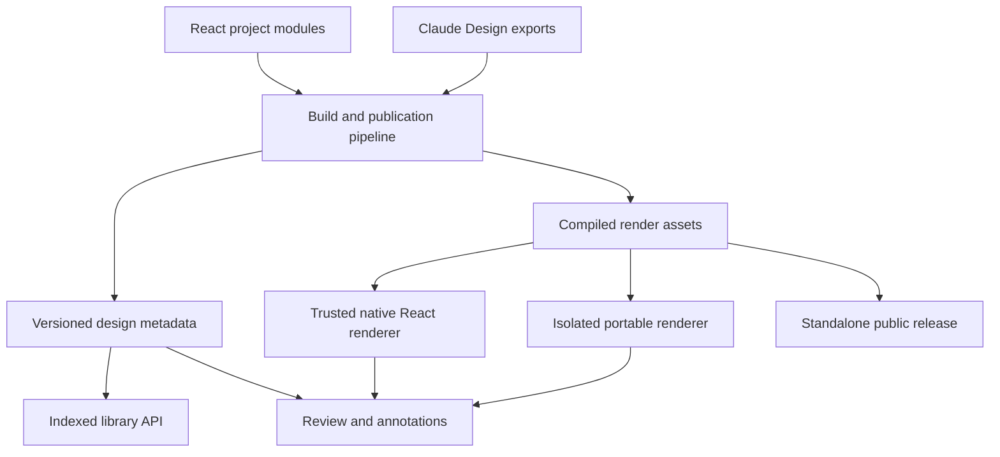

# Design platform architecture plan

Date: October 5, 2026

Status: Architecture proposal based on repository inspection, live publication manifests, and one local browser measurement. Revised October 5, 2026 after delivery-path review and a follow-up architecture review. Application-host probes inform hypotheses; authenticated artifact delivery remains unmeasured. No implementation or deployment is implied.

## Direction

Evolve Artifact Server into a design review platform with a shared catalog and annotation model, plus two rendering paths: native React for trusted components, and isolated previews for portable applications.

Support both React authoring and Claude Design exports long term. This is an explicit owner preference. Both formats should produce the same review metadata—pages, scenarios, sections, source references, and portable output—so annotations and sharing work consistently regardless of how a prototype was authored.

Start by measuring the delivery layer and addressing confirmed compression costs. The source excludes rangeable artifact responses from Node compression and marks leased preview responses `private, no-store`; their deployed transfer cost still needs measurement. Library assembly is a separate confirmed source-level bottleneck and follows in the implementation sequence. Treat caching and lease-origin changes as access-policy decisions, separate from compression. Removing iframes alone would leave both loading paths to improve.

## Review scope and evidence limits

The review covered the Artifact Server and Design repositories, the current manifests of all 11 published artifacts, rendering and annotation code, project descriptors, and the NY Courts template sources. ExtractionKit was also loaded locally in a browser.

The review did not change repository files or published artifacts. This plan is the subsequent requested documentation output.

The hosted browser required sign-in. Live manifests were inspected through MCP, but the authenticated hosted rendering delay was not reproduced. Source-derived request estimates and local measurements below are not hosted performance results.

The October 5 revision added a read-only `curl` of `https://artifacts.backend.app` (response headers and compressed sizes of the application bundles), a read of the production Helm values in the Workspace GitOps repository, and a trace through the content-serving, preview-lease, and compression code. Those findings are code- and header-derived; no authenticated artifact bytes were fetched.

The follow-up review checked the revised plan against the source and conformance ledger. It did not reproduce the earlier production probe. Application-host headers and one checked-in ingress configuration do not establish the complete deployed content-host path. Statements about artifact transfer encoding below remain hypotheses until a representative authorized content response is measured.

## Findings

| Finding | Implication |
|---|---|
| The library fetches artifact details, preview indexes, historical manifests, and sometimes comment/reply records before returning its results. | Opening the library performs substantial historical analysis. |
| Artifact Server already imports selected ArkCase components as React modules. | Native rendering has an established integration path to extend. |
| Portable projects use React 18.3.1; Artifact Server uses React 19.2.8, and Design's Storybook targets React 19. | Directly importing portable applications requires runtime adaptation. |
| Each of the ten Design publications contains the approximately 1.66 MiB DS bundle, plus roughly 1 MiB of icon CSS. | A small preview inherits a substantial common payload. These are uncompressed file sizes, not measured network transfer sizes. |
| ExtractionKit loads large fixture/data scripts immediately. The local run read about 16 MiB of resources, with first contentful paint around 0.65 seconds. | Payload reduction is warranted, but this local result does not establish the cause of the reported hosted 20-second delay. |
| Interactive previews and annotations use different rendering paths. | Switching into annotation mode can change what renders, especially for dynamic prototypes. |
| Preview identity is primarily a file path. | Forms' 23 scenarios and NY Courts' fragment routes cannot be represented adequately as independently reviewable views. |
| Version-content responses carry `Accept-Ranges: bytes`, which the Node compression wrapper treats as an exclusion; the inspected Helm values declare no ingress compress middleware. | The Node wrapper does not compress these responses. End-to-end artifact transfer encoding needs content-host measurement. |
| Private and historical Review previews obtain a fresh lease origin whose responses are forced to `private, no-store`. | These responses cannot use the browser HTTP cache across opens; other routes and external CDN resources have separate cache policies. |
| Public current-version bytes use `public, no-cache, must-revalidate`. | Repeat visits can revalidate using ETags and 304s. Overall public-versus-authenticated performance has not been measured. |
| Portable artboards reference React 18.3.1 UMD, while the vendored web components run under React 19. | Portable CDN dependencies and native runtime compatibility need separate handling. Native modules can share the host runtime while legacy previews retain React 18 in isolated documents. |

The library's [loader](apps/web/src/review/library/use-design-library.ts) waits for [history and comment calculations](apps/web/src/review/library/page-dates.ts). Using the actual gallery membership, the current cold path can require approximately **173 metadata requests before comment reads**, assuming successful reads and empty session caches. This is a source-derived estimate, not a captured network trace; it supersedes the preliminary estimate of roughly 188 requests discussed during the review.

Per gallery the cold path is three requests (artifact detail, preview index, unpaginated version list), plus manifests for uncached historical versions in a window of up to 40 versions; the current manifest is already available. Galleries with comments can add up to five comment pages and up to 40 thread reads, through a four-wide request limiter. The library, manifest-digest, and reply-time caches are module-level memory: they can survive client-side navigation but not a full page reload.

The live inventory contained 11 artifacts and 154 versions. Ten artifacts had preview indexes; NY Courts did not.

### Delivery observations and hypotheses (October 5)

| Observation | Where | Consequence |
|---|---|---|
| `contentHeaders` sets `Accept-Ranges: bytes` on version-content responses. | [create-http-app.ts](src/http/create-http-app.ts) `contentHeaders` | The [compression wrapper](src/http/node-response-compression.ts) skips these responses. It also buffers eligible bodies, which matters when extending it to blob streams. |
| The inspected Traefik ingress values declare no compress middleware; the earlier application-host probe reported Brotli application bundles and no CDN headers. | Workspace `deployments/clusters/vps/artifact-server/helm-values.yaml` | This suggests a delivery gap but does not establish active global middleware, upstream proxy behavior, or content-host response encoding. |
| Preview leases mint a `review-<56 hex>.frontend.app` origin per open with a 15-minute life, and `serveStoredVersionContent` forces `private, no-store` on lease responses. | [content-access.ts](src/application/content-access.ts) `issuePreviewLease`; create-http-app.ts `serveStoredVersionContent` | A new origin per open defeats the HTTP cache even if the headers were relaxed. |
| Authenticated non-current and private current content uses `private, no-store`, while the `/file`, `/media`, and `/archive` routes use `private, max-age=31536000, immutable`. | create-http-app.ts | Existing download/media policies are relevant precedent, but do not automatically establish the right policy for executable previews and short-lived leases. |
| `project/performance/FINDINGS.md` includes server-side browse and content-read measurements, but the authenticated prototype browser waterfall was not measured in this review. | [performance findings](project/performance/FINDINGS.md) | Add a hosted browser-delivery section alongside existing read and publication evidence. |

Representative raw payloads from the Design repository's generated files; these are not measured hosted transfer sizes:

| Asset | Raw size |
|---|---|
| `ds-bundle.js`, copied into all ten publications | 1.74 MB |
| `tokens/icons.css` | 1.04 MB |
| ExtractionKit `ek-data-*.js` fixtures, all loaded eagerly | 13.0 MB |

If the hosted path transfers roughly 16 MB without compression or cache reuse, that payload alone would require about 13 seconds at a sustained 10 Mbps, before accounting for latency and other overhead. This estimates transfer time, not the time before script execution: loading, parsing, and execution can overlap. It is a plausible contributor to the reported 20-second delay, not a measured diagnosis.

## Proposed architecture

Separate **what a design contains**, **how it renders**, and **how people review it**.

Today, Artifact Server often has to rediscover the first by inspecting files, while the second determines which review features work. Those concerns should have explicit contracts.

## 0. Measure delivery, then address confirmed costs

Establish separate library and prototype baselines before changing either path. Prioritize a bounded compression improvement if measurements confirm the gap. Evaluate caching and origin reuse separately; they can change access semantics and are not prerequisites for the catalog work.

**Capture useful evidence without publishing credentials or private content.** Measure authorized cold and warm library and ExtractionKit journeys against `artifacts.backend.app`. Record request counts by route class, transfer and decoded bytes, response encoding/cache headers, available server timing, first useful paint, and an explicit prototype-ready signal. Record the tested version, deployment revision, browser, device/network settings, cache state, and repeated samples. Keep raw HARs and traces outside Git in restricted local storage. Playwright's default HAR recording includes content; omitting bodies alone does not remove sensitive headers or URLs. Commit only a sanitized report with timings and sizes, stripping cookies, authorization headers, bootstrap and lease URLs/tokens (including capability-bearing hostnames), and private request/response content. See [Playwright HAR options](https://playwright.dev/docs/api/class-browser#browser-new-context-option-record-har). Add a browser-delivery section to [FINDINGS.md](project/performance/FINDINGS.md).

**Compress eligible full responses without buffering arbitrary artifacts.** The current wrapper calls `arrayBuffer()` before compression and assumes bodies are bounded in-memory assets. Simply removing its rangeable-response exclusion would buffer blob streams, increasing memory use and delaying first bytes under concurrency. Choose a streaming implementation with backpressure and cancellation, bounded precompressed variants keyed by digest and encoding, or a measured proxy configuration. Keep authorization ahead of private delivery. Preserve canonical stored bytes and hashes; encoded transfer variants are derivatives. Test `Accept-Encoding` negotiation including identity/refusal cases, `Vary`, representation validators, `HEAD`, `304`, `Range`/`If-Range`, `206`/`416`, disconnects, and large concurrent reads. Removing `Accept-Ranges` alone does not define correct range negotiation. Verify any Traefik middleware on the content-host route; keep the Workers deployment's edge-compression behavior independently qualified.

**Decide private-preview cache semantics before changing headers.** Immutable bytes do not imply immutable access. A fresh browser-cache response can bypass server authorization and expiry checks; `private` limits storage to private caches, not to one signed-in account. The existing `/file`, `/media`, and `/archive` policies do not automatically justify year-long caching of executable preview documents or lease responses. Define behavior for logout, account switching, access removal, lease expiry, and retained local copies. Choose among continued no-store, authorization-preserving revalidation, or explicitly bounded private freshness based on that contract. Keep current public-version content revalidating because public eligibility can change even though its bytes are immutable. See [Cache-Control semantics](https://developer.mozilla.org/en-US/docs/Web/HTTP/Reference/Headers/Cache-Control).

**Evaluate lease-origin reuse as a separate product decision.** Current leases provide short-lived, exact-version access without exposing application credentials. Reusing an unexpired lease scoped to the same principal and version may improve cache reuse, but requires lifecycle and account-switch handling. A stable per-version origin also changes persistent storage/service-worker behavior and must prove embedded content-session cookies work under supported browsers' third-party-cookie restrictions. Preserve CMT-018's exact-version and expiry boundary, raw-content sessions, and application isolation, or explicitly revise the relevant contracts before implementation. Test retained state and expiry in Chromium, Firefox, and WebKit. Do not assume origin reuse automatically makes a response cacheable.

Shared-asset deduplication across artifacts stays out of step 0. Blobs are already content-addressed in storage, but different browser URLs prevent automatic cross-artifact HTTP-cache reuse. A future shared asset service must retain authorization for private dependencies; a digest is an identifier, not an access grant. Deliberately public runtime assets can have a separate policy. Reconsider this work after measurement shows the remaining cost of per-artifact DS copies.

## 1. Make the library a server-side catalog

Reuse the existing catalog's authorization, repository, search, and pagination infrastructure, while adding a rebuildable projection of individual previews and, later, logical views. The current library displays and filters individual designs; artifact-level counts and a first thumbnail cannot replace that behavior without fetching indexes again. Keep artifact summaries where useful, but return a directly renderable page of preview/view records: exact project/artifact/version identity, path or view identity, title, description, kind, section, thumbnail reference, viewport, dates, and renderer capabilities.

Apply authorization and preview-level search/filtering/sorting before cursor pagination. Preserve exact-version links and the existing library's grouping and return state. The browser should display the first result page without fetching preview indexes, historical manifests, or comment threads per tile.

Prefer transactional projection writes when validated metadata is already available and the work fits each store's bounded publication transaction. Parse and validate source documents before that transaction; do not fetch blobs or perform unbounded dependency discovery while holding it. If indexing must happen separately, use idempotent jobs with durable progress and explicit pending/failed status, and advance the visible catalog revision consistently. A transactional projection does not require an outbox; asynchronous work does require a recovery strategy. Verify the choice for SQLite, PostgreSQL, and D1 instead of assuming identical transaction budgets.

Preserve per-preview creation, rendering-change, and comment-activity dates without rebuilding history in the browser. Maintain the needed summaries on publication, comment/reply changes, current-version changes, and artifact lifecycle changes. Backfill existing versions in bounded resumable passes without republishing or altering their bytes; expose incomplete dates honestly. Do not replace per-tile dates with per-artifact dates without a separate product decision.

Implementation direction:

- Keep immutable manifests and preview indexes as authoritative publication records.
- Put catalog operations behind a product-level port, implemented for SQLite, PostgreSQL, and D1.
- Paginate the currently unpaginated versions endpoint with compatible client updates; library rendering must no longer depend on reading it.
- Apply authorization before returning results, counts, or thumbnails.
- Reuse ART-009/ART-011 infrastructure and extend the DSN-005 library contract for server-side preview pagination, authorization, and recovery; retain existing conformance promises.

There is also a correctness improvement in both repositories. Artifact Server's page-change detection compares the HTML file's digest, so a shared stylesheet, fixture, or DS update can change the rendered page without changing that digest. Design's `targetAssetDigest` conservatively hashes all rendering assets in a target, including `ds-arkcase/`; this may invalidate more thumbnails than necessary but avoids missing unknown dependencies. The current server limitation is visible in [gallery date calculation](apps/web/src/review/library/design-library.ts).

Have the producer emit dependency metadata from its build graph or maintained descriptor, covering scripts, stylesheets, images, fonts, fixture data, dynamic imports, and other render inputs. The server manifest contains paths, hashes, sizes, and media types, not dependency edges: it cannot infer that graph by itself. Validate declared references against the immutable manifest and compute the fingerprint from verified digests plus renderer, scenario, viewport, and theme inputs. Pin external dependencies where possible and identify remaining external variability. Retain conservative target-wide invalidation when dependency coverage is incomplete, especially for legacy exports. Do not present an incomplete script/style scan as a complete rendering fingerprint.

## 2. Introduce logical views and scenarios

A file is a delivery unit. The review unit is often smaller or more specific:

- Forms → Builder → Validation inspector.
- ExtractionKit → Run details → Awaiting review.
- NY Courts → Claim → Financials tab.
- Ideas → Person card → Compact variant.
- Branding → A particular section of a guideline.

Extend publication metadata with stable identities:

| Identity | Purpose |
|---|---|
| `viewId` | A screen, specimen, document, or route |
| `scenarioId` | A reproducible state of that view |
| `regionId` | A section, panel, field, or component instance |
| `sourceRef` | The source revision and authored location |
| `renderFingerprint` | The exact rendering inputs |

Store route fragments and validated scenario parameters separately from file paths. The current [preview schema](src/manifest/preview-index.ts) expects HTML paths, rejects unknown fields, and disallows duplicate preview paths. Those rules are tested fail-closed under DSN-003-F and DSN-004-F, so do not loosen them. Add a separate views document with its own version alongside the preview index, so existing publications and their conformance IDs stay untouched.

Generate this metadata from the existing [Design project descriptors](../Dev/Design/workspace/projects/manifest.js). They already know artboards, configurations, scenarios, fixtures, and Storybook IDs; avoid maintaining a competing inventory manually.

## 3. Support native React selectively, with a portable fallback

The native integration already copies source components, contracts, tokens, and provenance into Artifact Server. Extend the [current sync contract](apps/web/src/arkcase/README.md).

For React-authored designs, add generated ES-module entry points and lazy-load the selected screen or component. Use one compatible React runtime per rendering environment. React's [`lazy` API](https://react.dev/reference/react/lazy) supports that loading model.

Native rendering is not required to investigate the current delivery costs, so schedule it after the initial performance work. Retain a small native pilot as an independent product evaluation: direct composition, component inspection, shared controls, authoring overhead, and annotation integration all matter. It is not conditional on the portable review SDK failing, and frozen public releases are not a prerequisite.

Portable artboards reference React 18.3.1 UMD from cdnjs, the DS bundle reads `window.React` through a proxy, and vendored modules in `apps/web/src/arkcase` run under the host's React 19. Compatible native modules must resolve to the host's React instance. Legacy React 18 previews remain in separate documents; migrating every artboard to React 19 is not required for a native pilot. External CDN scripts may use their own browser cache and do not necessarily transfer on every open. The shared `support.js` also contains an unpkg fallback: trace whether a given page actually reaches it before treating it as a loading failure. Keep Annotate and Interactive CSP behavior distinct when diagnosing CDN access.

Initially admit native modules through the existing reviewed build/sync pipeline. An uploaded artifact declaring itself "React" must not automatically become executable code inside the authenticated application.

| Renderer | Appropriate use |
|---|---|
| Native React | Reviewed first-party components and compatible project modules; direct component inspection and annotations |
| Isolated document | Claude Design exports, legacy applications, incompatible historical runtimes, and arbitrary uploaded HTML |

Same-page JavaScript receives the application's privileges. CSS scoping or Shadow DOM can help presentation, but cannot provide the security boundary of a separate browsing context. See the [browser iframe model](https://developer.mozilla.org/en-US/docs/Web/HTML/Reference/Elements/iframe).

An iframe also supplies a real viewport. Replacing it with a narrow `
` does not make existing viewport media queries or `window.innerWidth` behave like a phone. Native previews need container-aware layouts and preview context; retain isolated rendering where exact viewport behavior matters.

**Historical fidelity is essential:** an old artifact must not silently render with today's DS. Pin its renderer, dependencies, styles, and fixtures. If its runtime is incompatible with the current native host, open its preserved portable build.

## 4. Give both renderers the same annotation capabilities

Introduce a small review SDK with two adapters:

- A React adapter for native views.
- A browser adapter included in cooperating portable exports.

Both expose the same operations: ready, select region, capture view state, restore scenario, locate annotation, and focus target. The isolated adapter communicates through a validated, versioned message protocol; the host remains responsible for authorization and persistence.

This lets a reviewer interact with a prototype, open a drawer, and annotate the field inside it **without replacing the rendered application**.

An annotation should preserve:

- Exact artifact version, view, and scenario.
- Stable region or component-instance identity.
- Text quote and surrounding context when applicable.
- A relative point or rectangle as a fallback.
- Viewport, theme, locale, and reproducible fixture state.
- Optional captured visual evidence.
- Source provenance when the producer supplies it.

For example, "Forms, scenario 5, validation panel, minimum-length field" is more useful than a CSS selector alone.

The current [annotation protocol](apps/web/src/review-frame/protocol.ts) already supports selectors, element text, normalized points, and additional targets. Extend it compatibly. The [W3C annotation model](https://www.w3.org/TR/annotation-model/) provides useful conventions for text and fragment selectors.

Keep the original annotation attached to its original version. Across versions, offer a proposed placement with confidence and an explicit "location unavailable" state when uncertain.

Improve agent feedback by sending the scenario, region, source revision, and evidence along with the comment. Screen coordinates alone cannot identify a source-code change reliably.

## 5. Build once into appropriate delivery outputs

Supporting both authoring formats should not require maintaining two copies of each design.

For React sources, generate native module entries and a standalone application from the same source. For Claude Design exports, retain the original export and generate an optimized portable distribution plus review metadata.

Keep this work in a producer build pipeline initially. Artifact Server should validate and store the results; executing arbitrary uploaded build scripts inside the serving process would introduce a much larger responsibility.

Practical optimizations:

- Split screens and fixture data at meaningful navigation boundaries.
- Generate icon subsets for application chrome; load the full icon catalog only for icon browsing.
- Precompile any runtime JSX imports actually used.
- Produce minified distribution assets while retaining readable authored sources.
- Include pinned runtime dependencies in portable releases.
- Use thumbnails in libraries and activity lists, with live rendering on demand.
- Measure compression and caching at the actual serving boundary.

The [DS generator](../Dev/Design/scripts/build_ds_bundle.mjs) currently specifies `minify: false`. An in-memory experiment reduced its output from **1.74 MB to 1.01 MB**, or approximately **349 KB to 257 KB with gzip**. No generated bundle was changed. This helps, but loading only necessary components is the larger architectural improvement.

Artifact Server's [Node compression wrapper](src/http/node-response-compression.ts) deliberately excludes range-capable artifact streams. The inspected ingress values suggest an additional compression gap, but authenticated content-host transfer encoding remains unmeasured. Step 0 specifies verification and a bounded implementation approach.

Shared assets can reduce repeated browser downloads only when their URLs, authorization, and cache policy permit reuse. Storage deduplication alone does not achieve that. Private assets must retain their access restrictions. See the shared-asset note under step 0 for why this is deferred.

## Project-specific application

| Project | Best first improvement |
|---|---|
| `arkcase` | Native component/specimen registry generated from contracts, exports, and stories; pinned portable fallback |
| `arkcase-forms` | First scenario-aware review pilot: 23 existing scenarios and clear panel/field targets |
| `arkcase-icons` | Lazy style/category loading, virtualized results, and selective icon assets |
| `arkcase-branding` | Section-level annotations and lightweight document rendering |
| `arkcase-designer` | Native component inspection where compatible; preserve DCLogic through the portable adapter |
| `extraction-kit` | First payload-performance pilot. The large record and viewer payloads (`ek-data-design-record.js` 5.9 MB, `ek-data-viewer.js` 3.5 MB, `ek-data-record.js` 2.6 MB) load eagerly. Trace their dependencies and defer unneeded record/viewer data until its screen is selected; they are not necessarily interchangeable datasets. Preserve fixture bytes because the generator is retired. Investigate any exercised CDN fallback in canonical shared support, then regenerate mirrors; do not independently patch the project's `support.js`. |
| `arkcase-artifacts` | Reuse existing project-owned React review modules through the native renderer |
| `arkcase-ideas` | Component variants and deterministic object-card scenarios |
| `workers-compensation` | Screen-level loading and reproducible workflow states |
| `court-of-claims` | Same technical approach, preserving its deliberate exclusion from current publish groups |
| NY Courts | Register existing fragment routes as views; retain its lightweight vanilla-JS runtime initially |

NY Courts currently has no preview index, so the library loader omits it. It is a useful test that the new catalog works for non-React applications too. Its current source is documented in [the template guide](../Dev/NYCourts/design/templates/README.md).

Keep the two Court-related artifacts distinct. NYCourts' `AGENTS.md` prohibits publishing the high-fidelity `court-of-claims` prototype in the Design repository. NYCourts' `artifact-server.sh` publishes the separate `design/templates` tree to the existing NY Courts artifact. Those policies are not inherently contradictory. The AGENTS statement that Design's publish groups still include `court-of-claims` is stale and should be corrected separately. It does not block authorized indexing of the already-published NY Courts templates or authorize republishing the restricted prototype.

## Public sharing as an explicit release capability

Generate a standalone distribution with pinned dependencies, exact routes, and optional review integration. Give it both an immutable release URL and, where desired, a moving "latest" URL.

All 11 inspected artifacts are account-required. The inspected server path grants anonymous public access to the current version; durable public access to selected historical releases needs an explicit product contract. AUTH-004 limits a public link to the current version, and T24 explicitly defers a permanently-public access class, so this needs a recorded decision and new conformance IDs before any code.

Frozen releases provide a stable sharing target and may permit stronger caching under an explicit access contract. Current public-version content revalidates because public eligibility can change when the current pointer or access setting changes; its bytes are already immutable. An immutable release URL alone does not justify year-long public caching. Define whether releases are permanently public or revocable and what freshness window that permits, then choose headers accordingly. State plainly that downloaded or already-cached copies cannot be recalled. Keep this policy separate from private-preview caching.

## Recommended implementation order

0. **Establish the hosted delivery baseline and fix confirmed compression costs.** Keep raw captures private and commit sanitized before/after evidence. Prove bounded memory and correct HTTP behavior. Evaluate private caching and lease reuse as a separate contract decision, without blocking unrelated catalog work. Add the browser-delivery section to FINDINGS.md.
1. **Add preview-level catalog results and remove history reconstruction from first paint.** Reuse existing infrastructure, maintain a rebuildable projection, and return authorized, filtered, paginated preview/view records. Re-measure the library journey.
2. **Split ExtractionKit's data loading.** Load the dependencies needed by the selected screen and prove the hosted experience improves while retaining its current interactions.
3. **Add view/scenario identity and the portable review SDK to Forms.** Prove "open a state, annotate a region, reopen that exact state." Ship views as a separate document, not a preview-index change.
4. **Pilot native React specimens from `arkcase` and Ideas.** Evaluate composition, inspection, authoring overhead, and annotation integration independently of portable SDK success. Exercise shared-runtime compatibility, themes, portals, responsive behavior, and historical fallback.
5. **Add frozen public releases.** Record the T24 access/revocation decision and conformance IDs first, then deliver immutable release URLs with the cache policy that decision supports.

Start with step 0 to distinguish transfer, authorization, server, and rendering costs before choosing a delivery fix. Measure library assembly separately; it is not explained by prototype payload alone. The preview catalog, ExtractionKit split, and Forms annotation pilot follow, then the independent native React pilot and public releases. Keep Claude Design a supported authoring path throughout.

## Proposed acceptance targets

These are targets to calibrate against an agreed device, network, dataset, and repeatable measurement protocol—not measured promises:

- Eligible full artifact responses negotiate compression when the client accepts it; identity and range requests remain correct. Compression has bounded memory under concurrent large reads and does not buffer entire arbitrary artifacts before first bytes.
- Warm-load transfer reductions are measured against the baseline within the chosen cache and access contract. Zero transferred version bytes is not required after expiry, logout, account switching, or other events requiring renewed authorization.
- Raw authenticated captures remain outside Git; committed evidence contains no credentials, capability URLs, or private bodies.
- A useful first library page within one second on the agreed test network.
- Prototype readiness within two seconds for representative cold loads.
- Library result pages contain directly renderable previews with authorization, search, kind/project filters, and sorting applied before pagination; no per-tile preview-index, historical-manifest, or comment-thread fan-out is required.
- Projection backfill/recovery, current-version changes, comment activity, and incomplete dependency metadata preserve correct identities and honest freshness indicators.
- Private access remains enforced across catalog results, assets, previews, and annotations.
- Exact-version rendering preserves pinned dependencies and portable fallback.
- Annotations restore the intended scenario and region or explicitly report that their location is unavailable.
- Relevant behavior passes Chromium, Firefox, and WebKit checks.

Implementation must follow each repository's required generators, conformance checks, performance comparisons, and validation gates. This architecture review did not run those implementation gates, establish manual design approval, or qualify hosted performance.
