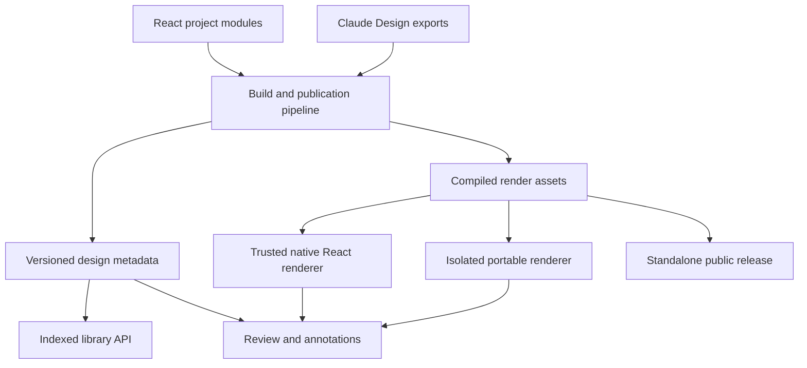

# Design platform architecture plan

Date: October 5, 2026

Status: Architecture proposal based on repository inspection, live publication manifests, and one local browser measurement. Revised October 5, 2026 after a code review of the delivery path and a read-only probe of the production deployment. No implementation or deployment is implied.

## Direction

Evolve Artifact Server into a design review platform with a shared catalog and annotation model, plus two rendering paths: native React for trusted components, and isolated previews for portable applications.

Support both React authoring and Claude Design exports long term. This is an explicit owner preference. Both formats should produce the same review metadata—pages, scenarios, sections, source references, and portable output—so annotations and sharing work consistently regardless of how a prototype was authored.

The biggest immediate improvement is the delivery layer, not the library. Every artifact byte reaches the browser uncompressed, and a signed-in reviewer gets no browser caching at all, so each Review open re-downloads the whole prototype. Those are small server changes with no schema or Design work. Moving library assembly out of the browser comes second. Removing iframes alone would leave both bottlenecks intact.

## Review scope and evidence limits

The review covered the Artifact Server and Design repositories, the current manifests of all 11 published artifacts, rendering and annotation code, project descriptors, and the NY Courts template sources. ExtractionKit was also loaded locally in a browser.

The review did not change repository files or published artifacts. This plan is the subsequent requested documentation output.

The hosted browser required sign-in. Live manifests were inspected through MCP, but the authenticated hosted rendering delay was not reproduced. Source-derived request estimates and local measurements below are not hosted performance results.

The October 5 revision added a read-only `curl` of `https://artifacts.backend.app` (response headers and compressed sizes of the application bundles), a read of the production Helm values in the Workspace GitOps repository, and a trace through the content-serving, preview-lease, and compression code. Those findings are code- and header-derived; no authenticated artifact bytes were fetched.

## Findings

| Finding | Implication |
|---|---|
| The library fetches artifact details, preview indexes, historical manifests, and sometimes comment/reply records before returning its results. | Opening the library performs substantial historical analysis. |
| Artifact Server already imports selected ArkCase components as React modules. | Native rendering has an established integration path to extend. |
| Portable projects use React 18.3.1; Artifact Server uses React 19.2.8, and Design's Storybook targets React 19. | Directly importing portable applications requires runtime adaptation. |
| Each of the ten Design publications contains the approximately 1.66 MiB DS bundle, plus roughly 1 MiB of icon CSS. | A small preview inherits a substantial common payload. These are uncompressed file sizes, not measured network transfer sizes. |
| ExtractionKit loads large fixture/data scripts immediately. The local run read about 16 MiB of resources, with first contentful paint around 0.65 seconds. | Payload reduction is warranted, but this local result does not establish the cause of the reported hosted 20-second delay. |
| Interactive previews and annotations use different rendering paths. | Switching into annotation mode can change what renders, especially for dynamic prototypes. |
| Preview identity is primarily a file path. | Forms' 23 scenarios and NY Courts' fragment routes cannot be represented adequately as independently reviewable views. |
| Every version file response carries `Accept-Ranges: bytes`, which the Node compression wrapper treats as an exclusion, and the production ingress has no compress middleware. | All artifact bytes are served uncompressed to everyone. Verified October 5; see the delivery findings below. |
| A Review preview loads through a fresh per-open lease origin whose responses are forced to `private, no-store`. | Signed-in reviewers get no browser caching across opens or reloads. |
| Public current-version bytes use `public, no-cache, must-revalidate`. | Anonymous repeat visits revalidate cheaply with 304s, so public users are currently better served than signed-in reviewers. First visits are still uncompressed. |
| Artboards load React 18.3.1 UMD from cdnjs on every preview open, while the vendored web copy runs React 19. | Each preview depends on an external CDN, and a native React path would carry two React copies until Design's artboards move to 19. |

The library's [loader](apps/web/src/review/library/use-design-library.ts) waits for [history and comment calculations](apps/web/src/review/library/page-dates.ts). Using the actual gallery membership, the current cold path can require approximately **173 metadata requests before comment reads**, assuming successful reads and empty session caches. This is a source-derived estimate, not a captured network trace; it supersedes the preliminary estimate of roughly 188 requests discussed during the review.

Per gallery the cold path is three requests (artifact detail, preview index, unpaginated version list) plus one manifest per version up to a window of 40, plus one to five comment pages, plus up to 40 thread reads, through a four-wide request limiter. Only the manifest digest map survives a page reload.

The live inventory contained 11 artifacts and 154 versions. Ten artifacts had preview indexes; NY Courts did not.

### Delivery findings (verified October 5)

| Observation | Where | Consequence |
|---|---|---|
| `contentHeaders` sets `Accept-Ranges: bytes` on every version file. | [create-http-app.ts](src/http/create-http-app.ts) `contentHeaders` | The [compression wrapper](src/http/node-response-compression.ts) skips any rangeable response by design, so no artifact byte is compressed by the application. |
| The Traefik ingress declares no compress middleware, and the live site shows no CDN headers. | Workspace `deployments/clusters/vps/artifact-server/helm-values.yaml` | No proxy compresses what the application does not. The application bundles arrive as brotli, which proves the Node wrapper is the only compressor. |
| Preview leases mint a `review-<56 hex>.frontend.app` origin per open with a 15-minute life, and `serveStoredVersionContent` forces `private, no-store` on lease responses. | [content-access.ts](src/application/content-access.ts) `issuePreviewLease`; create-http-app.ts `serveStoredVersionContent` | A new origin per open defeats the HTTP cache even if the headers were relaxed. |
| Authenticated non-current and private current bytes use `private, no-store`, while the `/file`, `/media`, and `/archive` routes already use `private, max-age=31536000, immutable`. | create-http-app.ts | The immutable policy is already accepted for the same bytes on other routes. |
| `project/performance/FINDINGS.md` has no reader-path entry. | risk register | Publish-side risks are tracked; delivery-side risks are not. |

Representative raw payloads, from the Design repository's generated files. Transfer sizes equal raw sizes today because nothing compresses them:

| Asset | Raw size |
|---|---|
| `ds-bundle.js`, copied into all ten publications | 1.74 MB |
| `tokens/icons.css` | 1.04 MB |
| ExtractionKit `ek-data-*.js` fixtures, all loaded eagerly | 13.0 MB |

A signed-in reviewer opening ExtractionKit therefore transfers roughly 16 MB uncompressed on every open. On a 10 Mbps link that is about 13 seconds before any script runs, which is the first plausible explanation of the reported 20-second hosted delay. This remains an inference until the hosted measurement in step 0 confirms it.

## Proposed architecture

Separate **what a design contains**, **how it renders**, and **how people review it**.

Today, Artifact Server often has to rediscover the first by inspecting files, while the second determines which review features work. Those concerns should have explicit contracts.

## 0. Fix delivery, then measure

Three server changes, none of which need a schema, an outbox, or a Design change. Do them before the catalog so the hosted measurement can attribute the remaining delay to the library rather than to the preview.

**Compress rangeable responses when no `Range` header is present.** The wrapper's stated concern is that encoded lengths must agree with range arithmetic. That only applies to partial responses. A full `200` response to a request without `Range` can be encoded, with `Accept-Ranges` dropped from the encoded variant so a later ranged request renegotiates against the identity form. Enabling Traefik's compress middleware in the Helm values is the alternative that needs no code; either way, compression runs after the access check and does not violate the boundary in [deployment.md](docs/deployment.md). Keep the Workers build relying on edge compression.

**Let authenticated immutable bytes be cached.** The `/file`, `/media`, and `/archive` routes already send `private, max-age=31536000, immutable`. The content-host route can send the same for private and non-current versions, because the bytes are immutable and the deployment doc already states that downloaded copies cannot be recalled. Public current-version bytes keep `no-cache, must-revalidate`, since the current pointer can move.

**Decide whether the Review frame must use a per-open lease origin.** The lease isolates artifact code from the reviewer's session, which is a real security property. The cost is that no two opens share an origin, so the cache never hits. Options, in rising order of change: reuse an unexpired lease for the same principal and version within its 15-minute life; or render through a stable per-version origin with the existing content-session cookie and keep the lease only for the annotation bridge. This is a product decision of the kind T24 records, not a tweak, and it needs the AUTH and CMT conformance entries that mention leases re-checked.

**Measure before and after.** There is no hosted measurement protocol today. Add a Playwright run against `artifacts.backend.app` that records a HAR for two journeys: open the library cold, and open ExtractionKit cold. Record request count, transfer bytes, server timing, first useful paint, and prototype-ready time. Commit the before run as the baseline and add a reader-path section to [FINDINGS.md](project/performance/FINDINGS.md) so delivery risks are tracked alongside publication risks.

Shared-asset deduplication across artifacts stays out of step 0. Blobs are already content-addressed in storage; the browser cannot share them because each artifact serves its own copy from its own origin. A stable content-addressed asset origin would be a capability URL, and whether a private artifact's dependency may be fetched by digest alone is a product decision. Decide it after step 0 shows how much the per-artifact DS copy still costs once it is compressed and cached.

## 1. Make the library a server-side catalog

Extend the existing project catalog rather than building a new projection. The artifact list endpoint already runs search, tag filtering, comment counts, sort, and cursor paging on the server under ART-009 and ART-011. Make it cross-project and add a small set of summary fields per artifact: whether the current version has a preview index, its item count, the first thumbnail reference, the newest version time, and the latest comment time. The browser then requests one page and displays it immediately.

For the per-tile dates that currently cost up to 40 manifest reads per gallery, add one small table written inside the publication transaction: artifact, version, preview path, and the newest version in which that path's rendering inputs changed. All three stores commit a publication in a single transaction, so no indexing job or outbox is needed. Backfill existing versions once from their stored manifests without republishing or altering bytes. Also question whether per-tile dates are worth keeping at all; a per-artifact newest-change date may be enough.

Implementation direction:

- Keep immutable manifests and preview indexes as authoritative publication records.
- Put catalog operations behind a product-level port, implemented for SQLite, PostgreSQL, and D1.
- Paginate the versions endpoint, which is unpaginated today.
- Apply authorization before returning results, counts, or thumbnails.
- Extend ART-009 and ART-011 or allocate adjacent IDs rather than inventing a parallel catalog contract.

There is also a correctness improvement in both repositories. Artifact Server's page-change detection compares the HTML file's digest, so a shared stylesheet, fixture, or DS update changes the rendered page without changing that digest. Design's thumbnail fingerprint goes the other way: `targetAssetDigest` hashes every rendering asset in the target including `ds-arkcase/`, so any DS change invalidates every thumbnail. Use a **render fingerprint over the page's transitive referenced scripts and stylesheets**, which the server can compute from the manifest at publication time. The current limitation is visible in [gallery date calculation](apps/web/src/review/library/design-library.ts).

## 2. Introduce logical views and scenarios

A file is a delivery unit. The review unit is often smaller or more specific:

- Forms → Builder → Validation inspector.
- ExtractionKit → Run details → Awaiting review.
- NY Courts → Claim → Financials tab.
- Ideas → Person card → Compact variant.
- Branding → A particular section of a guideline.

Extend publication metadata with stable identities:

| Identity | Purpose |
|---|---|
| `viewId` | A screen, specimen, document, or route |
| `scenarioId` | A reproducible state of that view |
| `regionId` | A section, panel, field, or component instance |
| `sourceRef` | The source revision and authored location |
| `renderFingerprint` | The exact rendering inputs |

Store route fragments and validated scenario parameters separately from file paths. The current [preview schema](src/manifest/preview-index.ts) expects HTML paths, rejects unknown fields, and disallows duplicate preview paths. Those rules are tested fail-closed under DSN-003-F and DSN-004-F, so do not loosen them. Add a separate views document with its own version alongside the preview index, so existing publications and their conformance IDs stay untouched.

Generate this metadata from the existing [Design project descriptors](../Dev/Design/workspace/projects/manifest.js). They already know artboards, configurations, scenarios, fixtures, and Storybook IDs; avoid maintaining a competing inventory manually.

## 3. Support native React selectively, with a portable fallback

The native integration already copies source components, contracts, tokens, and provenance into Artifact Server. Extend the [current sync contract](apps/web/src/arkcase/README.md).

For React-authored designs, add generated ES-module entry points and lazy-load the selected screen or component. Use one compatible React runtime per rendering environment. React's [`lazy` API](https://react.dev/reference/react/lazy) supports that loading model.

Nothing in the measured problem requires native rendering. The payload and caching costs are addressed by step 0 and the ExtractionKit split. Treat native React as an annotation-fidelity feature, gated on step 3 showing that the portable review SDK is insufficient, and keep it after the catalog and public-release work.

The runtime picture is also messier than a single version gap. Twenty-nine Design artboards load React 18.3.1 UMD from cdnjs with integrity hashes on every preview open, the DS bundle reads `window.React` through a proxy rather than bundling it, the vendored copy in `apps/web/src/arkcase` runs React 19, and `extraction-kit/project/support.js` still carries an unpkg `REACT_URL` that the artboard comment says is blocked. A native path therefore carries two React copies until Design's artboards move to 19, and every portable preview depends on an external CDN that the review frame's policy allows but Artifact Server does not vendor.

Initially admit native modules through the existing reviewed build/sync pipeline. An uploaded artifact declaring itself "React" must not automatically become executable code inside the authenticated application.

| Renderer | Appropriate use |
|---|---|
| Native React | Reviewed first-party components and compatible project modules; direct component inspection and annotations |
| Isolated document | Claude Design exports, legacy applications, incompatible historical runtimes, and arbitrary uploaded HTML |

Same-page JavaScript receives the application's privileges. CSS scoping or Shadow DOM can help presentation, but cannot provide the security boundary of a separate browsing context. See the [browser iframe model](https://developer.mozilla.org/en-US/docs/Web/HTML/Reference/Elements/iframe).

An iframe also supplies a real viewport. Replacing it with a narrow `
` does not make existing viewport media queries or `window.innerWidth` behave like a phone. Native previews need container-aware layouts and preview context; retain isolated rendering where exact viewport behavior matters.

**Historical fidelity is essential:** an old artifact must not silently render with today's DS. Pin its renderer, dependencies, styles, and fixtures. If its runtime is incompatible with the current native host, open its preserved portable build.

## 4. Give both renderers the same annotation capabilities

Introduce a small review SDK with two adapters:

- A React adapter for native views.
- A browser adapter included in cooperating portable exports.

Both expose the same operations: ready, select region, capture view state, restore scenario, locate annotation, and focus target. The isolated adapter communicates through a validated, versioned message protocol; the host remains responsible for authorization and persistence.

This lets a reviewer interact with a prototype, open a drawer, and annotate the field inside it **without replacing the rendered application**.

An annotation should preserve:

- Exact artifact version, view, and scenario.
- Stable region or component-instance identity.
- Text quote and surrounding context when applicable.
- A relative point or rectangle as a fallback.
- Viewport, theme, locale, and reproducible fixture state.
- Optional captured visual evidence.
- Source provenance when the producer supplies it.

For example, "Forms, scenario 5, validation panel, minimum-length field" is more useful than a CSS selector alone.

The current [annotation protocol](apps/web/src/review-frame/protocol.ts) already supports selectors, element text, normalized points, and additional targets. Extend it compatibly. The [W3C annotation model](https://www.w3.org/TR/annotation-model/) provides useful conventions for text and fragment selectors.

Keep the original annotation attached to its original version. Across versions, offer a proposed placement with confidence and an explicit "location unavailable" state when uncertain.

Improve agent feedback by sending the scenario, region, source revision, and evidence along with the comment. Screen coordinates alone cannot identify a source-code change reliably.

## 5. Build once into appropriate delivery outputs

Supporting both authoring formats should not require maintaining two copies of each design.

For React sources, generate native module entries and a standalone application from the same source. For Claude Design exports, retain the original export and generate an optimized portable distribution plus review metadata.

Keep this work in a producer build pipeline initially. Artifact Server should validate and store the results; executing arbitrary uploaded build scripts inside the serving process would introduce a much larger responsibility.

Practical optimizations:

- Split screens and fixture data at meaningful navigation boundaries.
- Generate icon subsets for application chrome; load the full icon catalog only for icon browsing.
- Precompile any runtime JSX imports actually used.
- Produce minified distribution assets while retaining readable authored sources.
- Include pinned runtime dependencies in portable releases.
- Use thumbnails in libraries and activity lists, with live rendering on demand.
- Measure compression and caching at the actual serving boundary.

The [DS generator](../Dev/Design/scripts/build_ds_bundle.mjs) currently specifies `minify: false`. An in-memory experiment reduced its output from **1.74 MB to 1.01 MB**, or approximately **349 KB to 257 KB with gzip**. No generated bundle was changed. This helps, but loading only necessary components is the larger architectural improvement.

Artifact Server's [Node compression wrapper](src/http/node-response-compression.ts) deliberately excludes range-capable artifact streams, and every version file is range-capable. Verified October 5: the deployed Traefik ingress does not compress them either. Step 0 covers the fix.

Shared assets can reduce repeated browser downloads only when their URLs, authorization, and cache policy permit reuse. Storage deduplication alone does not achieve that. Private assets must retain their access restrictions. See the shared-asset note under step 0 for why this is deferred.

## Project-specific application

| Project | Best first improvement |
|---|---|
| `arkcase` | Native component/specimen registry generated from contracts, exports, and stories; pinned portable fallback |
| `arkcase-forms` | First scenario-aware review pilot: 23 existing scenarios and clear panel/field targets |
| `arkcase-icons` | Lazy style/category loading, virtualized results, and selective icon assets |
| `arkcase-branding` | Section-level annotations and lightweight document rendering |
| `arkcase-designer` | Native component inspection where compatible; preserve DCLogic through the portable adapter |
| `extraction-kit` | First payload-performance pilot. The three datasets (`ek-data-design-record.js` 5.9 MB, `ek-data-viewer.js` 3.5 MB, `ek-data-record.js` 2.6 MB) load eagerly whichever is selected; load only the selected one. The data generator is retired, so do not plan on regenerated fixtures. Fix the unpkg `REACT_URL` leftover in `support.js`. |
| `arkcase-artifacts` | Reuse existing project-owned React review modules through the native renderer |
| `arkcase-ideas` | Component variants and deterministic object-card scenarios |
| `workers-compensation` | Screen-level loading and reproducible workflow states |
| `court-of-claims` | Same technical approach, preserving its deliberate exclusion from current publish groups |
| NY Courts | Register existing fragment routes as views; retain its lightweight vanilla-JS runtime initially |

NY Courts currently has no preview index, so the library loader omits it. It is a useful test that the new catalog works for non-React applications too. Its current source is documented in [the template guide](../Dev/NYCourts/design/templates/README.md).

The NY Courts publication status is contradictory and must be settled before it is indexed. `~/Dev/NYCourts/AGENTS.md` states the prototype is never published and still claims Design's publish configuration lists `court-of-claims`, while Design removed `court-of-claims` from every publish group on October 5 and the NYCourts shell script publishes `design/templates` as a new version of one fixed artifact. Decide which of those is the intended behavior and correct the stale document.

## Public sharing as an explicit release capability

Generate a standalone distribution with pinned dependencies, exact routes, and optional review integration. Give it both an immutable release URL and, where desired, a moving "latest" URL.

All 11 inspected artifacts are account-required. The inspected server path grants anonymous public access to the current version; durable public access to selected historical releases needs an explicit product contract. AUTH-004 limits a public link to the current version, and T24 explicitly defers a permanently-public access class, so this needs a recorded decision and new conformance IDs before any code.

Frame the feature as the public-performance win it is. Public current-version bytes must stay `no-cache, must-revalidate` because the pointer can move. A frozen release at an immutable URL is the one place `public, max-age=31536000, immutable` is safe, and that is what lets a public visitor load a prototype from cache. A frozen public release should define its access and revocation behavior separately from the working artifact's current pointer, and revocation must state plainly that already-cached copies cannot be recalled.

## Recommended implementation order

0. **Fix delivery and establish the hosted baseline.** Record the before HAR, then compress non-ranged responses, cache authenticated immutable bytes, and decide the lease-origin question. Record the after HAR. Add the reader-path section to FINDINGS.md.
1. **Extend the catalog and remove history reconstruction from first paint.** Cross-project listing with preview summary fields and the publish-time page-change table. Re-measure the library journey.
2. **Split ExtractionKit's data loading.** Load only the selected dataset and prove the hosted experience improves while retaining its current interactions.
3. **Add view/scenario identity and the portable review SDK to Forms.** Prove "open a state, annotate a region, reopen that exact state." Ship views as a separate document, not a preview-index change.
4. **Add frozen public releases.** Record the T24 decision and conformance IDs first, then deliver immutable public URLs with immutable caching.
5. **Add native React specimens from `arkcase` and Ideas**, only if step 3 shows the portable SDK cannot reach the needed annotation fidelity. Exercise runtime compatibility, themes, portals, responsive behavior, and historical fallback.

Start with step 0 because it is the cheapest change with the largest expected effect, and because its measurement decides how much of the remaining delay the catalog work has to explain. The catalog extension, ExtractionKit split, and Forms annotation pilot follow; together they address current delays and establish the contracts needed for native React integration, while keeping Claude Design a supported authoring path.

## Proposed acceptance targets

These are targets to calibrate against an agreed device, network, dataset, and repeatable measurement protocol—not measured promises:

- Every compressible artifact response without a `Range` header arrives encoded, and a second open of the same version by a signed-in reviewer transfers no version bytes.
- A useful first library page within one second on the agreed test network.
- Prototype readiness within two seconds for representative cold loads.
- No historical-manifest fan-out during library browsing.
- Private access remains enforced across catalog results, assets, previews, and annotations.
- Exact-version rendering preserves pinned dependencies and portable fallback.
- Annotations restore the intended scenario and region or explicitly report that their location is unavailable.
- Relevant behavior passes Chromium, Firefox, and WebKit checks.

Implementation must follow each repository's required generators, conformance checks, performance comparisons, and validation gates. This architecture review did not run those implementation gates, establish manual design approval, or qualify hosted performance.
