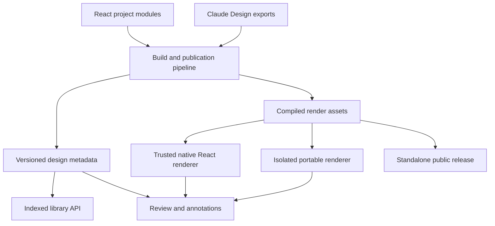

# Design platform architecture plan

Date: October 5, 2026

Status: Architecture proposal based on repository inspection, live publication manifests, and one local browser measurement. No implementation or deployment is implied.

## Direction

Evolve Artifact Server into a design review platform with a shared catalog and annotation model, plus two rendering paths: native React for trusted components, and isolated previews for portable applications.

Support both React authoring and Claude Design exports long term. This is an explicit owner preference. Both formats should produce the same review metadata—pages, scenarios, sections, source references, and portable output—so annotations and sharing work consistently regardless of how a prototype was authored.

The biggest immediate improvement is moving library assembly out of the browser. Removing iframes alone would leave that bottleneck and several prototype-loading costs intact.

## Review scope and evidence limits

The review covered the Artifact Server and Design repositories, the current manifests of all 11 published artifacts, rendering and annotation code, project descriptors, and the NY Courts template sources. ExtractionKit was also loaded locally in a browser.

The review did not change repository files or published artifacts. This plan is the subsequent requested documentation output.

The hosted browser required sign-in. Live manifests were inspected through MCP, but the authenticated hosted rendering delay was not reproduced. Source-derived request estimates and local measurements below are not hosted performance results.

## Findings

| Finding | Implication |
|---|---|
| The library fetches artifact details, preview indexes, historical manifests, and sometimes comment/reply records before returning its results. | Opening the library performs substantial historical analysis. |
| Artifact Server already imports selected ArkCase components as React modules. | Native rendering has an established integration path to extend. |
| Portable projects use React 18.3.1; Artifact Server uses React 19.2.8, and Design's Storybook targets React 19. | Directly importing portable applications requires runtime adaptation. |
| Each of the ten Design publications contains the approximately 1.66 MiB DS bundle, plus roughly 1 MiB of icon CSS. | A small preview inherits a substantial common payload. These are uncompressed file sizes, not measured network transfer sizes. |
| ExtractionKit loads large fixture/data scripts immediately. The local run read about 16 MiB of resources, with first contentful paint around 0.65 seconds. | Payload reduction is warranted, but this local result does not establish the cause of the reported hosted 20-second delay. |
| Interactive previews and annotations use different rendering paths. | Switching into annotation mode can change what renders, especially for dynamic prototypes. |
| Preview identity is primarily a file path. | Forms' 23 scenarios and NY Courts' fragment routes cannot be represented adequately as independently reviewable views. |

The library's [loader](apps/web/src/review/library/use-design-library.ts) waits for [history and comment calculations](apps/web/src/review/library/page-dates.ts). Using the actual gallery membership, the current cold path can require approximately **173 metadata requests before comment reads**, assuming successful reads and empty session caches. This is a source-derived estimate, not a captured network trace; it supersedes the preliminary estimate of roughly 188 requests discussed during the review.

The live inventory contained 11 artifacts and 154 versions. Ten artifacts had preview indexes; NY Courts did not.

## Proposed architecture

Separate **what a design contains**, **how it renders**, and **how people review it**.

Today, Artifact Server often has to rediscover the first by inspecting files, while the second determines which review features work. Those concerns should have explicit contracts.

## 1. Make the library a server-side catalog

Add a rebuildable database projection of published designs. Each entry should contain its title, kind, project, exact artifact version, thumbnail, view identity, supported renderers, and relevant dates.

Populate it when a publication commits. Maintain it when the current version changes, comments change, or an artifact is archived or deleted. Search, filtering, sorting, and pagination then become database operations.

The browser should request one page of catalog results and display it immediately. It should not fetch historical manifests to date the tiles.

Implementation direction:

- Keep immutable manifests and preview indexes as authoritative publication records.
- Put catalog operations behind a product-level port, implemented for SQLite, PostgreSQL, and D1.
- Use an idempotent indexing job or transactional outbox where indexing cannot share the publication transaction.
- Track indexing status and failures explicitly.
- Backfill existing versions without republishing or altering their bytes.
- Apply authorization before returning results, counts, or thumbnails.

There is also a correctness improvement: current page-change detection compares the HTML file's digest. A shared stylesheet, fixture, or DS update can change the rendered page without changing that HTML. Use a **render fingerprint incorporating its dependencies**, building on Design's existing thumbnail fingerprinting approach. The current limitation is visible in [gallery date calculation](apps/web/src/review/library/design-library.ts).

## 2. Introduce logical views and scenarios

A file is a delivery unit. The review unit is often smaller or more specific:

- Forms → Builder → Validation inspector.
- ExtractionKit → Run details → Awaiting review.
- NY Courts → Claim → Financials tab.
- Ideas → Person card → Compact variant.
- Branding → A particular section of a guideline.

Extend publication metadata with stable identities:

| Identity | Purpose |
|---|---|
| `viewId` | A screen, specimen, document, or route |
| `scenarioId` | A reproducible state of that view |
| `regionId` | A section, panel, field, or component instance |
| `sourceRef` | The source revision and authored location |
| `renderFingerprint` | The exact rendering inputs |

Store route fragments and validated scenario parameters separately from file paths. The current [preview schema](src/manifest/preview-index.ts) expects HTML paths and disallows duplicate preview paths, which is too restrictive for this use case.

Generate this metadata from the existing [Design project descriptors](../Dev/Design/workspace/projects/manifest.js). They already know artboards, configurations, scenarios, fixtures, and Storybook IDs; avoid maintaining a competing inventory manually.

## 3. Support native React selectively, with a portable fallback

The native integration already copies source components, contracts, tokens, and provenance into Artifact Server. Extend the [current sync contract](apps/web/src/arkcase/README.md).

For React-authored designs, add generated ES-module entry points and lazy-load the selected screen or component. Use one compatible React runtime per rendering environment. React's [`lazy` API](https://react.dev/reference/react/lazy) supports that loading model.

Initially admit native modules through the existing reviewed build/sync pipeline. An uploaded artifact declaring itself "React" must not automatically become executable code inside the authenticated application.

| Renderer | Appropriate use |
|---|---|
| Native React | Reviewed first-party components and compatible project modules; direct component inspection and annotations |
| Isolated document | Claude Design exports, legacy applications, incompatible historical runtimes, and arbitrary uploaded HTML |

Same-page JavaScript receives the application's privileges. CSS scoping or Shadow DOM can help presentation, but cannot provide the security boundary of a separate browsing context. See the [browser iframe model](https://developer.mozilla.org/en-US/docs/Web/HTML/Reference/Elements/iframe).

An iframe also supplies a real viewport. Replacing it with a narrow `
` does not make existing viewport media queries or `window.innerWidth` behave like a phone. Native previews need container-aware layouts and preview context; retain isolated rendering where exact viewport behavior matters.

**Historical fidelity is essential:** an old artifact must not silently render with today's DS. Pin its renderer, dependencies, styles, and fixtures. If its runtime is incompatible with the current native host, open its preserved portable build.

## 4. Give both renderers the same annotation capabilities

Introduce a small review SDK with two adapters:

- A React adapter for native views.
- A browser adapter included in cooperating portable exports.

Both expose the same operations: ready, select region, capture view state, restore scenario, locate annotation, and focus target. The isolated adapter communicates through a validated, versioned message protocol; the host remains responsible for authorization and persistence.

This lets a reviewer interact with a prototype, open a drawer, and annotate the field inside it **without replacing the rendered application**.

An annotation should preserve:

- Exact artifact version, view, and scenario.
- Stable region or component-instance identity.
- Text quote and surrounding context when applicable.
- A relative point or rectangle as a fallback.
- Viewport, theme, locale, and reproducible fixture state.
- Optional captured visual evidence.
- Source provenance when the producer supplies it.

For example, "Forms, scenario 5, validation panel, minimum-length field" is more useful than a CSS selector alone.

The current [annotation protocol](apps/web/src/review-frame/protocol.ts) already supports selectors, element text, normalized points, and additional targets. Extend it compatibly. The [W3C annotation model](https://www.w3.org/TR/annotation-model/) provides useful conventions for text and fragment selectors.

Keep the original annotation attached to its original version. Across versions, offer a proposed placement with confidence and an explicit "location unavailable" state when uncertain.

Improve agent feedback by sending the scenario, region, source revision, and evidence along with the comment. Screen coordinates alone cannot identify a source-code change reliably.

## 5. Build once into appropriate delivery outputs

Supporting both authoring formats should not require maintaining two copies of each design.

For React sources, generate native module entries and a standalone application from the same source. For Claude Design exports, retain the original export and generate an optimized portable distribution plus review metadata.

Keep this work in a producer build pipeline initially. Artifact Server should validate and store the results; executing arbitrary uploaded build scripts inside the serving process would introduce a much larger responsibility.

Practical optimizations:

- Split screens and fixture data at meaningful navigation boundaries.
- Generate icon subsets for application chrome; load the full icon catalog only for icon browsing.
- Precompile any runtime JSX imports actually used.
- Produce minified distribution assets while retaining readable authored sources.
- Include pinned runtime dependencies in portable releases.
- Use thumbnails in libraries and activity lists, with live rendering on demand.
- Measure compression and caching at the actual serving boundary.

The [DS generator](../Dev/Design/scripts/build_ds_bundle.mjs) currently specifies `minify: false`. An in-memory experiment reduced its output from **1.74 MB to 1.01 MB**, or approximately **349 KB to 257 KB with gzip**. No generated bundle was changed. This helps, but loading only necessary components is the larger architectural improvement.

Artifact Server's [Node compression wrapper](src/http/node-response-compression.ts) deliberately excludes range-capable artifact streams. Whether the deployed proxy compresses those responses needs live verification.

Shared assets can reduce repeated browser downloads only when their URLs, authorization, and cache policy permit reuse. Storage deduplication alone does not achieve that. Private assets must retain their access restrictions.

## Project-specific application

| Project | Best first improvement |
|---|---|
| `arkcase` | Native component/specimen registry generated from contracts, exports, and stories; pinned portable fallback |
| `arkcase-forms` | First scenario-aware review pilot: 23 existing scenarios and clear panel/field targets |
| `arkcase-icons` | Lazy style/category loading, virtualized results, and selective icon assets |
| `arkcase-branding` | Section-level annotations and lightweight document rendering |
| `arkcase-designer` | Native component inspection where compatible; preserve DCLogic through the portable adapter |
| `extraction-kit` | First payload-performance pilot: load run, record, and viewer data when needed |
| `arkcase-artifacts` | Reuse existing project-owned React review modules through the native renderer |
| `arkcase-ideas` | Component variants and deterministic object-card scenarios |
| `workers-compensation` | Screen-level loading and reproducible workflow states |
| `court-of-claims` | Same technical approach, preserving its deliberate exclusion from current publish groups |
| NY Courts | Register existing fragment routes as views; retain its lightweight vanilla-JS runtime initially |

NY Courts currently has no preview index, so the library loader omits it. It is a useful test that the new catalog works for non-React applications too. Its current source is documented in [the template guide](../Dev/NYCourts/design/templates/README.md).

## Public sharing as an explicit release capability

Generate a standalone distribution with pinned dependencies, exact routes, and optional review integration. Give it both an immutable release URL and, where desired, a moving "latest" URL.

All 11 inspected artifacts are account-required. The inspected server path grants anonymous public access to the current version; durable public access to selected historical releases needs an explicit product contract. A frozen public release should define its access and revocation behavior separately from the working artifact's current pointer.

## Recommended implementation order

1. **Index the library and measure hosted loading.** Remove history reconstruction from first paint. Capture request counts, bytes, server timing, first useful paint, and prototype-ready timing.
2. **Optimize ExtractionKit's delivery.** Prove that staged data loading and compiled assets improve the actual hosted experience while retaining its current interactions.
3. **Add view/scenario identity and the portable review SDK to Forms.** Prove "open a state, annotate a region, reopen that exact state."
4. **Add native React specimens from `arkcase` and Ideas.** Exercise runtime compatibility, themes, portals, responsive behavior, and historical fallback.
5. **Add frozen public releases and expand project coverage.**

Start with the catalog projection, ExtractionKit payload work, and Forms annotation pilot. Together they address current delays and establish the contracts needed for native React integration, while keeping Claude Design a supported authoring path.

## Proposed acceptance targets

These are targets to calibrate against an agreed device, network, dataset, and repeatable measurement protocol—not measured promises:

- A useful first library page within one second on the agreed test network.
- Prototype readiness within two seconds for representative cold loads.
- No historical-manifest fan-out during library browsing.
- Private access remains enforced across catalog results, assets, previews, and annotations.
- Exact-version rendering preserves pinned dependencies and portable fallback.
- Annotations restore the intended scenario and region or explicitly report that their location is unavailable.
- Relevant behavior passes Chromium, Firefox, and WebKit checks.

Implementation must follow each repository's required generators, conformance checks, performance comparisons, and validation gates. This architecture review did not run those implementation gates, establish manual design approval, or qualify hosted performance.
